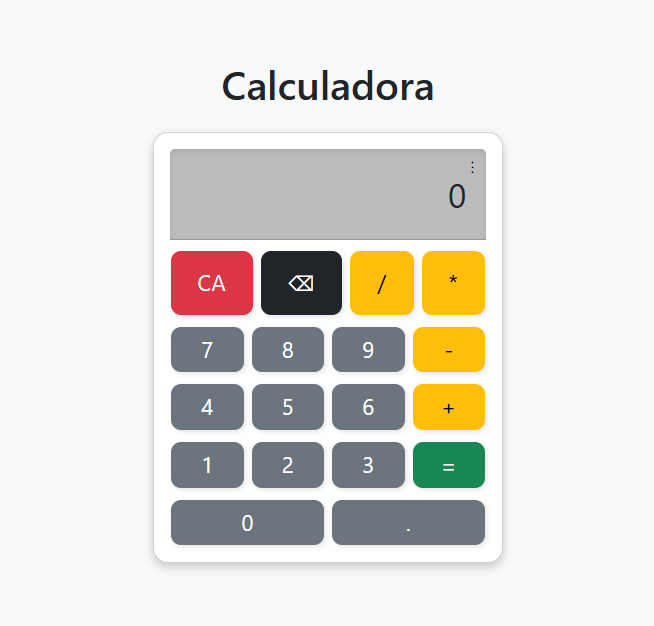
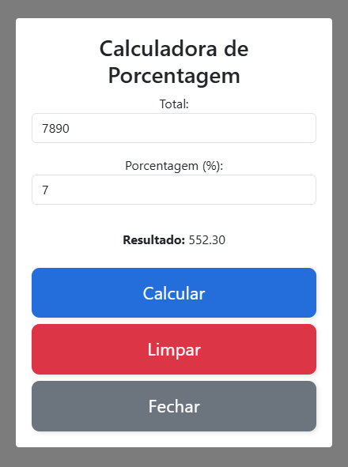
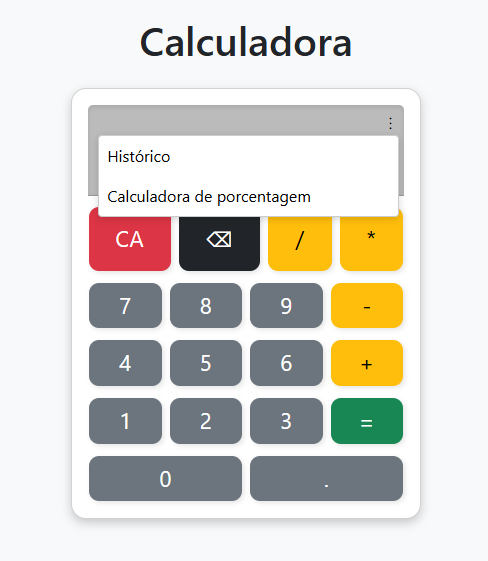

# Calculadora React



## Descrição

Este projeto é uma calculadora desenvolvida utilizando **React**, **Bootstrap 5**, **CSS** e **JavaScript**. Ela permite realizar operações matemáticas básicas como **adição (+), subtração (-), multiplicação (x) e divisão (/)**, além de uma funcionalidade específica para cálculo de porcentagem.

---

## Funcionalidades atuais

- Operações básicas: soma, subtração, multiplicação e divisão.
- Cálculo de porcentagem.
- Botões para limpar (CA), apagar último dígito, e realizar o cálculo.
- Interface responsiva e estilizada com Bootstrap 5 e CSS customizado.
- Histórico simples de operações (menu de opções).
- Resultados exibidos com precisão e em tempo real.

---

## Tecnologias utilizadas

- React (biblioteca JavaScript para construção de interfaces).
- Bootstrap 5 (framework CSS para layout e estilos).
- CSS customizado para ajustes visuais.
- JavaScript para lógica das operações.

---

## Como rodar o projeto localmente

### Pré-requisitos

- Node.js e npm instalados ([download aqui](https://nodejs.org/)).

### Passos

1. Clone o repositório:
   ```bash´´
   git clone <URL_DO_REPOSITORIO>


2. Acesse a pasta do projeto:
   ```bash´´
   cd nome-da-pasta


3. Instale as dependências:
   ```bash´´
   npm install


4. Inicie o servidor de desenvolvimento:
   ```bash´´
   npm start


5. Abra o navegador e acesse:
   ```bash´´
   http://localhost:3000

A calculadora estará rodando e pronta para uso.

### Evidências do funcionamento

### Calculadora principal


### Calculadora com opção de porcentagem



### Menu de opções



### Próximas funcionalidades
Este projeto está em constante evolução. Em breve, serão implementados novos tipos de cálculos, incluindo:

* Cálculo de fatorial.

* Funções trigonométricas (seno, cosseno, tangente).

* Operações com números decimais avançados.

* Histórico completo das operações realizadas.

### Considerações finais
Este projeto demonstra o domínio das tecnologias React, Bootstrap e JavaScript para criar aplicações interativas e funcionais. A estrutura modular do código permite fácil manutenção e expansão das funcionalidades. A interface amigável e responsiva oferece uma boa experiência para o usuário.

### Autor
Gabriel Gonzaga De Oliveira - [[LinkedIn](https://www.linkedin.com/in/gabriel-gonzaga-dev/)]